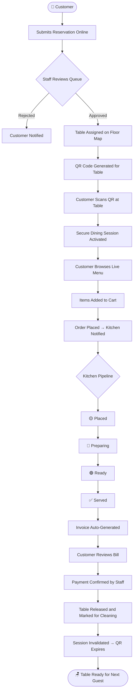

<div align="center">

<br />

<!-- LOGO -->


<br />
<br />

# ✦ Spice Garden

### *Where Heritage Meets Modern Luxury*

> A full-stack, real-time restaurant management system built for fine dining — from reservation to table release, every touchpoint is engineered with precision.

<br />

[](https://github.com/PARTHPANCHAL3656/restaurant-platform)
[](./LICENSE)
[](https://react.dev)
[](https://nodejs.org)
[](https://mongodb.com)
[](https://socket.io)

<br />

[](https://github.com/PARTHPANCHAL3656/restaurant-platform/stargazers)
[](https://github.com/PARTHPANCHAL3656/restaurant-platform/network/members)
[](https://github.com/PARTHPANCHAL3656/restaurant-platform/graphs/contributors)

<br />

[](https://spice-garden.vercel.app)
[](https://spice-garden-api.onrender.com)
[](https://spice-garden.vercel.app)

<br />

---

</div>

## 📖 About the Project

**Spice Garden** is a production-grade, full-stack restaurant management system designed for luxury Indian fine dining establishments. It replaces fragmented tools like paper reservations, manual order tracking, and static menus with a unified, real-time digital ecosystem.

The system operates across two surfaces:

- **Customer Portal** — A beautifully crafted dining experience: browse a live menu, place orders, track preparation status, and receive bills — all from a QR-scanned table session.
- **Staff Portal** — A powerful operations hub: manage reservations, assign tables, generate QR codes, process live orders, handle billing, and release tables — with every action synchronized in real time across all connected devices.

Built with a **single source of truth** architecture, MongoDB is the authoritative data store and Socket.IO ensures sub-second synchronization between customer and staff interfaces without page refreshes.

<br />

> **Why Spice Garden?**
> Most restaurant software is either too simple (static PDFs and WhatsApp orders) or too expensive (enterprise POS systems). Spice Garden bridges the gap — a fully integrated, open-source, deployable system built for real operational workflows.

<br />

---

## ✨ Features

<details open>
<summary><strong>🪑 Customer Features</strong></summary>

<br />

| Feature | Description |
|---|---|
| **Online Reservation** | Book a table with date, time, party size, and special requests |
| **Waitlist / Walk-in** | Join the guest queue when no tables are available |
| **QR-Triggered Menu** | Scan a table-specific QR code to start a secure dining session |
| **Live Menu Browsing** | Browse all dishes by category with filters, search, and real-time availability |
| **Smart Cart** | Add, remove, and adjust quantities before placing an order |
| **Order Tracking** | Live order pipeline — Placed → Preparing → Ready → Served |
| **Digital Bill** | Automatically generated invoice with GST and service charge breakdown |
| **Session Security** | JWT-secured table sessions that expire after payment and table release |

</details>

<details>
<summary><strong>👨‍💼 Staff Features</strong></summary>

<br />

| Feature | Description |
|---|---|
| **Secure Staff Login** | JWT-authenticated portal with role-based session management |
| **Reservation Queue** | View, approve, reassign, and cancel incoming reservations |
| **Guest Waitlist** | Manage walk-in queue with party size, wait time, and VIP flags |
| **Floor Map** | Visual table grid with live status: Available / Reserved / Occupied / Cleaning |
| **Table Assignment** | Assign approved reservations to specific tables |
| **QR Generation** | Generate a unique, signed JWT-embedded QR code per table session |
| **Live Order Board** | Real-time kitchen order pipeline with one-click status advancement |
| **Invoice Management** | Auto-generated invoices with manual override and payment confirmation |
| **Table Release** | Close sessions, mark tables for cleaning, and prepare for the next guest |
| **Activity Feed** | Live dashboard feed showing recent reservations, orders, and billing events |

</details>

<details>
<summary><strong>🍽️ Menu Management</strong></summary>

<br />

| Feature | Description |
|---|---|
| **Full CRUD** | Add, edit, duplicate, and delete menu items |
| **Category Management** | Organize items across Starters, Mains, Rice & Biryani, Breads, Desserts, Cocktails |
| **Availability Toggle** | Mark items Out of Stock in real time — instantly reflected on customer menu |
| **Chef Special Flags** | Highlight signature and recommended items |
| **Image & Metadata** | Per-item image, prep time, spice level, and food type (Veg/Non-Veg/Vegan) |
| **Live Sync** | Menu changes broadcast via Socket.IO — no customer refresh needed |

</details>

<details>
<summary><strong>⚡ Real-Time Features</strong></summary>

<br />

| Event | Trigger | Consumer |
|---|---|---|
| `reservation:new` | Customer submits a reservation | Staff sees it instantly in the queue |
| `reservation:updated` | Staff approves / rejects | Customer notified; table status updates |
| `table:updated` | Table assigned or status changed | Floor map refreshes across all staff tabs |
| `order:new` | Customer places an order | Kitchen order board updates in real time |
| `order:updated` | Staff advances order status | Customer tracking screen updates live |
| `menu:updated` | Staff edits menu item | Customer menu refreshes without reload |
| `invoice:generated` | Payment triggered | Bill appears on customer screen |
| `table:released` | Table freed post-payment | Floor map and session invalidated |

</details>

<details>
<summary><strong>🔐 Security Features</strong></summary>

<br />

| Layer | Implementation |
|---|---|
| **Staff Auth** | HS256 JWT signed with `JWT_SECRET`, expires in 12 hours |
| **Table Sessions** | Per-table JWTs embedded in QR codes, scoped to a single dining session |
| **Route Guards** | `ProtectedRoute` blocks all staff pages without a valid token |
| **Token Isolation** | Staff tokens in `localStorage`; table tokens in `sessionStorage` — never mixed |
| **Interceptor Logic** | Axios interceptor auto-attaches the correct token per route type |
| **Session Expiry** | On `401/403`, the correct session-expired event is dispatched to the UI |
| **Environment Secrets** | All secrets in `.env` — never committed, validated on startup |

</details>

<br />

---

## 📸 Screenshots

<details open>
<summary><strong>Customer Experience</strong></summary>

<br />

| Landing Page | Reservation | Menu |
|:---:|:---:|:---:|
|  |  |  |

| Cart | Order Tracking | Invoice |
|:---:|:---:|:---:|
|  |  |  |

</details>

<details>
<summary><strong>Staff Operations</strong></summary>

<br />

| Dashboard | Table Management | Orders |
|:---:|:---:|:---:|
|  |  |  |

| Menu Management | Reservations | Billing |
|:---:|:---:|:---:|
|  |  |  |

</details>

<br />

---

## 🔄 Complete Restaurant Workflow



<br />

---

## 🛠️ Tech Stack

<div align="center">

### Frontend

[](https://react.dev)
[](https://vitejs.dev)
[](https://tailwindcss.com)
[](https://www.framer.com/motion)
[](https://reactrouter.com)

### Backend

[](https://nodejs.org)
[](https://expressjs.com)
[](https://socket.io)
[](https://jwt.io)

### Database and Deployment

[](https://mongodb.com)
[](https://vercel.com)
[](https://render.com)

</div>

<br />

| Layer | Technology | Purpose |
|---|---|---|
| UI Framework | React 18 + Vite | Component-based SPA with fast HMR |
| Styling | Tailwind CSS + Custom Design Tokens | Luxury design system with semantic tokens |
| Animations | Framer Motion | Page transitions, micro-animations, presence effects |
| State Management | React Context API | Centralized `StaffContext` + `CartContext` |
| API Client | Axios with Interceptors | Auto-token injection, unified error handling |
| Real-time | Socket.IO Client | Bidirectional event-driven UI updates |
| Backend | Express.js (ESM) | RESTful API with modular routing |
| Auth | JSON Web Tokens (HS256) | Staff sessions + scoped table sessions |
| Database | MongoDB + Mongoose | Schema-driven ODM with Atlas cloud hosting |
| QR Generation | `qrcode` npm package | Signed JWT-embedded QR codes per table |
| Deployment | Vercel (FE) + Render (BE) | Zero-config CI/CD pipelines |

<br />

---

## 🏗️ Project Architecture

<details open>
<summary><strong>Folder Structure</strong></summary>

```
spice-garden/
│
├── 📁 src/                          # Frontend (React + Vite)
│   ├── 📁 assets/
│   │   └── 📁 images/               # Organized menu/landing/gallery assets
│   │       ├── menu/starters/
│   │       ├── menu/mains/
│   │       ├── menu/rice/
│   │       ├── menu/breads/
│   │       ├── menu/desserts/
│   │       ├── menu/beverages/
│   │       ├── landing/
│   │       └── gallery/
│   ├── 📁 components/
│   │   ├── 📁 staff/                # Staff UI components
│   │   ├── CartDrawer.jsx
│   │   └── Footer.jsx
│   ├── 📁 context/
│   │   ├── StaffContext.jsx          # Auth, tables, orders, menu, reservations
│   │   └── CartContext.jsx           # Customer cart, session, order tracking
│   ├── 📁 pages/
│   │   ├── 📁 staff/                # Staff portal pages
│   │   │   ├── StaffLoginPage.jsx
│   │   │   ├── StaffDashboardPage.jsx
│   │   │   ├── StaffTablesPage.jsx
│   │   │   ├── StaffOrdersPage.jsx
│   │   │   ├── StaffMenuPage.jsx
│   │   │   ├── StaffBillingPage.jsx
│   │   │   └── StaffGuestQueuePage.jsx
│   │   ├── LandingPage.jsx
│   │   ├── MenuPage.jsx
│   │   ├── ReservationPage.jsx
│   │   ├── CartPage.jsx
│   │   └── OrderTrackingPage.jsx
│   ├── 📁 utils/
│   │   ├── api.js                    # Axios instance with interceptors
│   │   ├── assetHelper.js            # Vite-compatible image resolver
│   │   └── socket.js                 # Socket.IO client singleton
│   └── App.jsx
│
├── 📁 backend/                       # Backend (Express + Socket.IO)
│   └── 📁 src/
│       ├── 📁 controllers/
│       ├── 📁 models/
│       ├── 📁 routes/
│       ├── 📁 middleware/
│       └── index.js
│
├── 📁 docs/
│   └── 📁 screenshots/
├── .env
├── vite.config.js
└── README.md
```

</details>

<br />

---

## 🔌 API Overview

<details>
<summary><strong>Authentication — /api/auth</strong></summary>

<br />

| Method | Endpoint | Auth | Description |
|---|---|---|---|
| `POST` | `/api/auth/login` | Public | Staff login with master password, returns JWT |

</details>

<details>
<summary><strong>Reservations — /api/reservations</strong></summary>

<br />

| Method | Endpoint | Auth | Description |
|---|---|---|---|
| `POST` | `/api/reservations` | Public | Customer submits a reservation |
| `GET` | `/api/reservations` | Staff JWT | List all reservations |
| `PATCH` | `/api/reservations/:id` | Staff JWT | Update status (approve/reject/complete) |
| `DELETE` | `/api/reservations/:id` | Staff JWT | Remove a reservation |

</details>

<details>
<summary><strong>Tables — /api/tables</strong></summary>

<br />

| Method | Endpoint | Auth | Description |
|---|---|---|---|
| `GET` | `/api/tables` | Staff JWT | Get all tables with live status |
| `POST` | `/api/tables/assign` | Staff JWT | Assign reservation to table, generate QR |
| `POST` | `/api/tables/free` | Staff JWT | Release table, close session |
| `PATCH` | `/api/tables/:id/status` | Staff JWT | Set table to cleaning / available |
| `GET` | `/api/tables/waiting` | Staff JWT | Get waitlist queue |
| `POST` | `/api/tables/waiting` | Public | Customer joins waitlist |

</details>

<details>
<summary><strong>Orders — /api/orders</strong></summary>

<br />

| Method | Endpoint | Auth | Description |
|---|---|---|---|
| `POST` | `/api/orders` | Table JWT | Customer places an order |
| `GET` | `/api/orders/all-active` | Staff JWT | All active orders for kitchen board |
| `GET` | `/api/orders/my` | Table JWT | Customer fetches their order status |
| `PATCH` | `/api/orders/:id/status` | Staff JWT | Advance order status in pipeline |

</details>

<details>
<summary><strong>Invoices — /api/invoices</strong></summary>

<br />

| Method | Endpoint | Auth | Description |
|---|---|---|---|
| `POST` | `/api/invoices/generate` | Staff JWT | Generate invoice for a table |
| `GET` | `/api/invoices` | Staff JWT | List all invoices |
| `GET` | `/api/invoices/my` | Table JWT | Customer fetches their bill |
| `PATCH` | `/api/invoices/:id/pay` | Staff JWT | Mark invoice as paid |

</details>

<details>
<summary><strong>Menu — /api/menu</strong></summary>

<br />

| Method | Endpoint | Auth | Description |
|---|---|---|---|
| `GET` | `/api/menu` | Public | Get all menu items |
| `POST` | `/api/menu` | Staff JWT | Create a new menu item |
| `PATCH` | `/api/menu/:id` | Staff JWT | Update menu item |
| `DELETE` | `/api/menu/:id` | Staff JWT | Remove menu item |

</details>

<br />

---

## 📡 Socket.IO Events

| Event | Direction | Trigger |
|---|---|---|
| `reservation:new` | Server → Staff | Customer submits a reservation |
| `reservation:updated` | Server → All | Staff approves or rejects |
| `table:updated` | Server → All | Table status changes |
| `table:released` | Server → All | Staff releases a table |
| `order:new` | Server → Staff | Customer places an order |
| `order:updated` | Server → All | Kitchen advances order status |
| `menu:updated` | Server → All | Staff edits a menu item |
| `invoice:generated` | Server → All | Invoice created for a session |
| `invoice:paid` | Server → All | Payment confirmed |
| `waitingList:updated` | Server → Staff | Waitlist changes |

<br />

---

## 🚀 Installation and Setup

### Prerequisites

- Node.js `v18+`
- MongoDB (local or [Atlas](https://cloud.mongodb.com))
- npm or yarn

### 1. Clone the Repository

```bash
git clone https://github.com/PARTHPANCHAL3656/restaurant-platform.git
cd spice-garden
```

### 2. Backend Setup

```bash
cd backend
npm install
```

Create `backend/.env`:

```env
PORT=5000
MONGO_URI=mongodb://localhost:27017/restaurant
JWT_SECRET=your-super-secret-jwt-key
STAFF_PASSWORD=your-staff-master-password
FRONTEND_URL=http://localhost:5174
```

Start the backend:

```bash
npm run dev
```

### 3. Frontend Setup

```bash
# From project root
npm install
```

Create `.env` in project root:

```env
VITE_API_URL=http://localhost:5000
```

Start the frontend:

```bash
npm run dev
```

> Frontend: `http://localhost:5174` · Backend: `http://localhost:5000`

<br />

---

## 🔑 Environment Variables

### Frontend (`.env`)

| Variable | Required | Description |
|---|---|---|
| `VITE_API_URL` | ✅ | Backend base URL |

### Backend (`backend/.env`)

| Variable | Required | Description |
|---|---|---|
| `PORT` | ✅ | Server port (default: `5000`) |
| `MONGO_URI` | ✅ | MongoDB connection string |
| `JWT_SECRET` | ✅ | Secret key for signing JWTs |
| `STAFF_PASSWORD` | ✅ | Master password for staff login |
| `FRONTEND_URL` | ✅ | Frontend origin for CORS whitelist |

<br />

---

## 🧭 Usage Guide

<details open>
<summary><strong>Customer Flow</strong></summary>

<br />

1. Visit the landing page to explore the restaurant
2. Submit a reservation with your name, date, time, and party size
3. Arrive at the restaurant and receive your assigned table
4. Scan the QR code on your table to start a secure dining session
5. Browse the live menu, add items to cart, and place your order
6. Track your order status in real time on the Order Status page
7. View your digital bill once staff generates your invoice
8. Confirm payment with your server — the session closes automatically

</details>

<details>
<summary><strong>Staff Flow</strong></summary>

<br />

1. Log in to the Staff Portal at `/staff/login`
2. Monitor the Dashboard for live activity — reservations, orders, billing
3. Approve or reject reservations in the Reservations queue
4. Assign approved guests to available tables on the Floor Map
5. Generate a QR code — the system creates a signed table session automatically
6. Watch the Orders Board — advance order status as the kitchen prepares dishes
7. Generate an invoice when guests are ready to leave
8. Mark payment as confirmed and release the table
9. Manage the menu at any time — add dishes, toggle availability, update prices

</details>

<br />

---

## 🗺️ Roadmap

<details open>
<summary><strong>✅ Completed</strong></summary>

- [x] Customer reservation system with real-time staff notification
- [x] QR-triggered secure table sessions
- [x] Full customer menu with cart and order placement
- [x] Real-time order tracking pipeline
- [x] Auto-generated digital invoices with GST and service charge
- [x] Staff dashboard with live activity feed
- [x] Visual floor map with table status management
- [x] Staff menu CRUD with live sync to customer interface
- [x] Guest waitlist and walk-in queue management
- [x] JWT-secured auth for staff and table sessions
- [x] Socket.IO real-time sync across all connected clients
- [x] Responsive design for mobile, tablet, and desktop

</details>

<details>
<summary><strong>🔮 Future Features</strong></summary>

- [ ] Analytics Dashboard — Revenue charts and peak hour insights
- [ ] Role-based access control (Manager, Waiter, Kitchen)
- [ ] Kitchen Display System (KDS) — Dedicated tablet view
- [ ] WhatsApp / SMS reservation confirmations
- [ ] Stripe / Razorpay online payment integration
- [ ] Inventory management linked to menu availability
- [ ] Progressive Web App (PWA) for staff mobile use
- [ ] Multi-branch support

</details>

<br />

---

## 🤝 Contributing

<details>
<summary><strong>Contribution Guide</strong></summary>

<br />

1. Fork the repository
2. Create a feature branch: `git checkout -b feature/your-feature-name`
3. Follow the code style:
   - Use functional React components with hooks
   - All shared state must live in Context
   - Backend is the single source of truth — no mock data in production
   - Socket events must be emitted from the backend only
4. Test both customer and staff workflows before submitting
5. Open a Pull Request with a clear description and screenshots for UI changes

</details>

<br />

---

## 📄 License

Distributed under the **MIT License**. See [`LICENSE`](./LICENSE) for details.

<br />

---

## 🙏 Acknowledgements

| Resource | Purpose |
|---|---|
| [Framer Motion](https://www.framer.com/motion) | Premium animations and micro-interactions |
| [Socket.IO](https://socket.io) | Real-time bidirectional communication |
| [Shields.io](https://shields.io) | README badges |
| [QRCode.js](https://github.com/soldair/node-qrcode) | Table QR code generation |
| [Mongoose](https://mongoosejs.com) | MongoDB schema ODM |
| [Google Fonts](https://fonts.google.com) | Cormorant Garamond luxury serif typography |
| [Material Symbols](https://fonts.google.com/icons) | Consistent icon system |

<br />

---

## 👥 Contributors

We thank the following individuals who built and engineered Spice Garden:

| Developer | Role | Profile |
|---|---|---|
| **Khushi Singh** | Frontend Lead Developer & UI/UX Architect | [@khushi897920-lang](https://github.com/khushi897920-lang) |
| **Parth Panchal** | Backend Lead Developer & System Architect | [@PARTHPANCHAL3656](https://github.com/PARTHPANCHAL3656) |

<br />

---

## 💬 Support

If you encounter a bug or need help:

1. Search [existing issues](https://github.com/PARTHPANCHAL3656/restaurant-platform/issues) first
2. Open a [new issue](https://github.com/PARTHPANCHAL3656/restaurant-platform/issues/new) with a clear title and steps to reproduce
3. Include browser console logs and screenshots where applicable

<br />

---

## 📬 Contact

| Contributor | GitHub Profile |
|---|---|
| **Khushi Singh** | [@khushi897920-lang](https://github.com/khushi897920-lang) |
| **Parth Panchal** | [@PARTHPANCHAL3656](https://github.com/PARTHPANCHAL3656) |

<br />

---

<div align="center">

**⭐ If Spice Garden impressed you, please star the repository — it helps others discover the project.**

<br />

---

<sub>Built with passion for fine dining and precision engineering · Spice Garden © 2025</sub>

</div>

