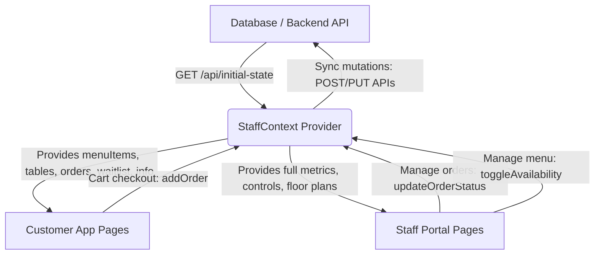

# Backend Integration & Frontend Architecture Guide
## Spice Garden Restaurant Platform

This document describes the final frontend structure and acts as a technical specification for the backend development team to achieve a seamless integration.

---

## 1. Final Frontend Folder Structure

The React frontend has been consolidated into a clean, modular structure. There is a **single source of truth** for data (`StaffContext.jsx`) and a **unified asset helper** (`assetHelper.js`) to handle dynamic Vite asset resolving.

```
src/
├── assets/
│   └── images/
│       ├── branding/          # Logos, icons, branding marks
│       ├── landing/           # Hero slides, restaurant interiors, chef profile photos
│       ├── gallery/           # Editorial gallery captures (gallery-1 to gallery-5)
│       ├── qr/                # Table QR codes (table-01 to table-14)
│       └── menu/              # Standardized menu items (flat subfolders)
│           ├── starters/      # Starter dish images (e.g., hara-bhara-kebab.jpg)
│           ├── mains/         # Mains (e.g., dal-makhani.jpg, palak-paneer.jpg)
│           ├── rice/          # Rice/Biryani (e.g., nawabi-mutton-biryani.jpg)
│           ├── breads/        # Flatbreads (e.g., butter-naan.jpg, garlic-naan.jpg)
│           ├── desserts/      # Desserts (e.g., belgian-chocolate-brownie.jpg)
│           └── beverages/     # Cocktails/Drinks (e.g., garden-elixir.jpg)
├── components/
│   ├── staff/                 # Staff Portal shared UI components (Sidebar, Header, etc.)
│   ├── CartDrawer.jsx         # Guest Cart drawer slide-over
│   ├── Navbar.jsx             # Guest navigation header
│   └── Footer.jsx             # Dynamic guest footer (consumes metadata from context)
├── context/
│   ├── StaffContext.jsx       # Consolidated restaurant engine (State Source of Truth)
│   └── CartContext.jsx        # Coordinates guest selection and dispatches checkout orders
├── pages/
│   ├── staff/                 # Staff Portal Views (Dashboard, Tables, Orders, Menu, etc.)
│   ├── MenuPage.jsx           # Guest menu page (respects stock/availability flags)
│   └── OrderTrackingPage.jsx  # Live guest order tracking page
├── utils/
│   └── assetHelper.js         # Resolves image paths dynamically from the flat directory structure
└── App.jsx                    # Root wrapper establishing context hierarchy
```

---

## 2. Shared State Architecture

The frontend uses **context propagation** to keep guest pages and staff dashboards synchronized in real time.



---

## 3. Database Schema Recommendations

To support the frontend structures out of the box, the backend database should be structured around these **six core entities**:

### A. Menu Catalog (`menu_items`)
Stores the catalog and availability parameters.
```sql
CREATE TABLE menu_items (
    id VARCHAR(50) PRIMARY KEY,       -- e.g., 'dal-makhani'
    name VARCHAR(100) NOT NULL,       -- e.g., 'Dal Makhani'
    price DECIMAL(10, 2) NOT NULL,
    category VARCHAR(50) NOT NULL,    -- 'Starters', 'Mains', 'Rice & Biryani', 'Breads', 'Desserts', 'Signature Cocktails'
    tag VARCHAR(50),                  -- e.g., 'Veg Signature'
    description TEXT,
    image VARCHAR(100),               -- Filename only: 'dal-makhani.jpg'
    available BOOLEAN DEFAULT true,   -- stock toggle
    special BOOLEAN DEFAULT false,    -- chef curation
    food_type VARCHAR(20),            -- 'Vegetarian', 'Non Vegetarian', 'Vegan'
    prep_time VARCHAR(20),            -- e.g., '20 min'
    spice_level VARCHAR(20)           -- 'Mild', 'Medium', 'Hot'
);
```

### B. Tables Floor Map (`restaurant_tables`)
Controls table occupancies and waiter assignments.
```sql
CREATE TABLE restaurant_tables (
    id VARCHAR(10) PRIMARY KEY,        -- e.g., 'T-01'
    number INT NOT NULL,               -- e.g., 1
    section VARCHAR(20) NOT NULL,      -- 'Indoor', 'Terrace', 'Lounge'
    capacity INT NOT NULL,             -- e.g., 4
    status VARCHAR(20) DEFAULT 'Ready', -- 'Ready', 'Occupied', 'Cleaning'
    current_guest VARCHAR(100),        -- guest name if occupied
    assigned_waiter VARCHAR(100),      -- waiter name
    active_order_id VARCHAR(50)        -- links to live order
);
```

### C. Live Orders (`orders`)
Pipes checkouts to the kitchen.
```sql
CREATE TABLE orders (
    id VARCHAR(50) PRIMARY KEY,        -- e.g., 'ORD-2026-9872'
    table_id VARCHAR(10) REFERENCES restaurant_tables(id),
    table_number INT,
    guest_name VARCHAR(100),
    items JSONB NOT NULL,              -- Array of: {id, name, quantity, price}
    subtotal DECIMAL(10, 2),
    service_charge DECIMAL(10, 2),
    gst DECIMAL(10, 2),
    total DECIMAL(10, 2) NOT NULL,
    status VARCHAR(20) DEFAULT 'Received', -- 'Received', 'Preparing', 'Ready', 'Completed'
    timestamp TIMESTAMP DEFAULT CURRENT_TIMESTAMP
);
```

### D. Waitlist (`waitlist`)
Manages the walking queue.
```sql
CREATE TABLE waitlist (
    id INT GENERATED ALWAYS AS IDENTITY PRIMARY KEY,
    name VARCHAR(100) NOT NULL,
    party_size INT NOT NULL,
    phone VARCHAR(20),
    status VARCHAR(20) DEFAULT 'Waiting', -- 'Waiting', 'Seated', 'Cancelled'
    timestamp TIMESTAMP DEFAULT CURRENT_TIMESTAMP
);
```

### E. Reservations (`reservations`)
Tracks future bookings.
```sql
CREATE TABLE reservations (
    id INT GENERATED ALWAYS AS IDENTITY PRIMARY KEY,
    name VARCHAR(100) NOT NULL,
    guests INT NOT NULL,
    date DATE NOT NULL,
    time TIME NOT NULL,
    status VARCHAR(20) DEFAULT 'Pending' -- 'Pending', 'Confirmed', 'Cancelled'
);
```

### F. Invoices (`invoices`)
Audit ledger for the accountant.
```sql
CREATE TABLE invoices (
    id VARCHAR(50) PRIMARY KEY,        -- e.g., 'INV-2026-1049'
    order_id VARCHAR(50) REFERENCES orders(id),
    table_id VARCHAR(10),
    guest_name VARCHAR(100),
    total DECIMAL(10, 2) NOT NULL,
    status VARCHAR(20) DEFAULT 'Paid', -- 'Paid', 'Refunded'
    date VARCHAR(20)                   -- e.g., 'Today, 03:45 PM'
);
```

---

## 4. API Endpoints Contract

The backend should provide the following RESTful API routes:

| Method | Endpoint | Description | Payload Example |
| :--- | :--- | :--- | :--- |
| **GET** | `/api/restaurant/state` | Fetches consolidated initial state (tables, menu, active orders, queue) | *None* |
| **POST** | `/api/orders` | Places a new order from a customer table | `{ tableId: "T-01", items: [...], total: 72.50 }` |
| **PUT** | `/api/orders/:id/status` | Updates order kitchen state (staff panel) | `{ status: "Preparing" }` |
| **PUT** | `/api/menu/:id/available` | Toggles item availability (out of stock) | `{ available: false }` |
| **POST** | `/api/reservations` | Guest booking request | `{ name: "John", guests: 4, date: "2026-07-10", time: "19:30" }` |
| **POST** | `/api/tables/:id/release` | Releases table and clears guest assignments | *None* |
| **POST** | `/api/tables/:id/assign` | Seats a waitlist party to a table | `{ guestName: "Sarah", waiter: "Rahul" }` |

---

## 5. Real-Time Synchronization Strategy

> [!IMPORTANT]
> Because guests check out from their own mobile phones at their tables and staff manage orders on a central iPad dashboard, standard HTTP polling will cause delays.

### Recommended Stack:
*   **WebSockets (socket.io / ws)**: The backend should broadcast event payloads whenever a change occurs:
    1.  `order_created` (broadcast to staff board)
    2.  `order_updated` (broadcast to tracking customer screen)
    3.  `table_state_changed` (broadcast to Maître d' floor plan)
    4.  `menu_stock_changed` (broadcast to update all customer menu page availability instantly)

Your frontend team has already decoupled these pages so that replacing the React Context state hooks with a WebSocket/Redux reducer layer will require **zero changes** to visual components.
